[toc]

# 嵌入式开发总结

## 外设通讯
### 通讯概述
* serial/parallel 串行/并行
* synchronous/asynchronous 同步/异步
* point-to-point/bus 点对点/总线
* half-duplex/full-duplex 半双工/全双工
* master-slave/equal partners 主从/对等
* single-ended/differential 单端/差分信号

#### 串行
* 数据是一位一位传输的
* 需要少量的线和端口
* 带宽小，慢
* 长的传输距离

#### 并行
* 数据是以字节为单位传输的
* 需要大量的线和端口
* 快
* 短的传输距离

串行并行的快慢是相对的，目前，主流的通讯又回归到串行中，如USB，以太网等。

#### 同步
* 接收端和发送端共用时钟
* 速度快

#### 异步
* 接收端和发送端时钟独立
* 接收端提前获得传输速率
* 开始停止位
* 速度慢

#### 半双工
* 每一时刻的通讯信道只能有一台设备在线
* 如，对讲机

#### 全双工
* 允许两台设备同时相互传输信息

#### master-slave 主从
* 只有主设备可以发起通讯
* USB
#### equal partners 对等
* 每台设备都可以发送数据
* 需要仲裁

 总线类型 | 线数 | 通讯类型 | 多主 | 波特率 | 器件数目 | 双工 |
-|-|-|-|-|-|-|
 UART(SCI)  |   2   | 异步  |  NO  | 3K-4M  |   2       | 全    |
 SPI   |   3   | 同步  |  YES |   >1M  |   <10     |    全      |
I2C   |   2   | 同步  |  YES |   < 3.4M|   <10     |    半  |
CAN   |   2   | 异步  |  YES |  20K-1M|   128     |     半  |
USB   |   2   | 异步  |  NO  |   480M |   127     |--   |

### UART 通用异步接收发送装置 
SCI 通用串行通讯接口 两者相互兼容

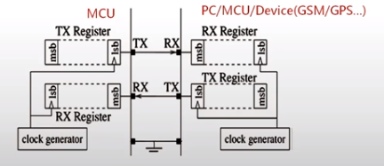

两个设备各有一个时钟，共用地线。如果时钟存在大的偏差，容易导致数据失帧错误。
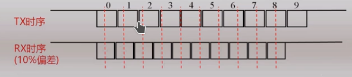

UART通讯的时序图如下图所示，两个设备使用相同的波特率。
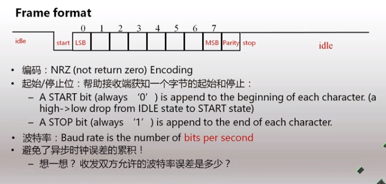
1. 先传低位，再传高位
2. 奇偶校验位
3. 配置参数 baud rate, #data bits, parity, #stop bits
4. 9600, 8N1 9600 bps 8位数据帧 无校验 1位停止位
5. 由于接收端可能出现信号跳动的情况，在接收端通过过采样(oversampling)的方法，保证采集的数据正确。如下图所示。

以ARM为例，对于发送端每个周期内，接收端采用16倍的速度，进行采样。通过中间3位投票决定数据正确与否。
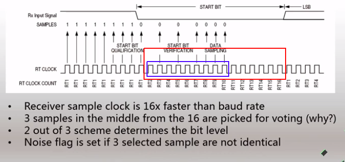
确保数据传输不失帧，接收端波特率误差的计算如下，注意9是过采样中3位表决位的最后一位的index。
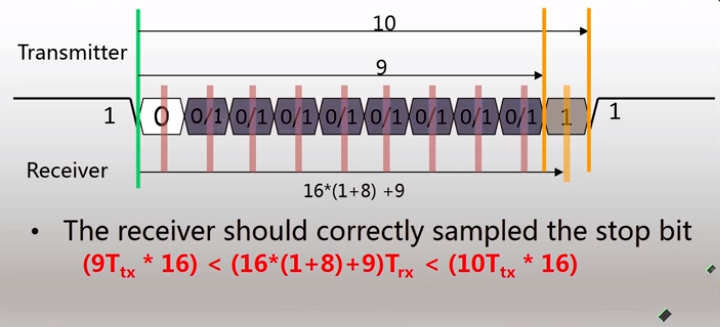
为了保证数据无误的另一手段是奇偶校验。手段是，通过添加0或1，保证数据中1的总数目是奇数或偶数。
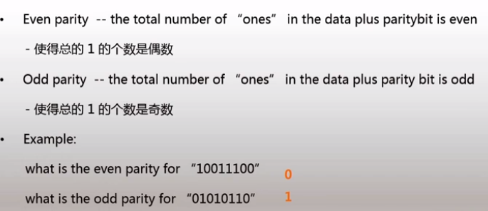

#### 电平类型
##### RS232接口
PC机上的串行信号电平接口（9pin），与MCU上的电平TTL，并不一致，需要转换，对于pc没有该接口，可以使用USB转串行借口实现(cp2102)。
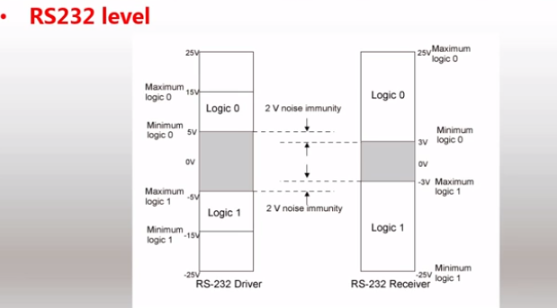
##### TTL电平
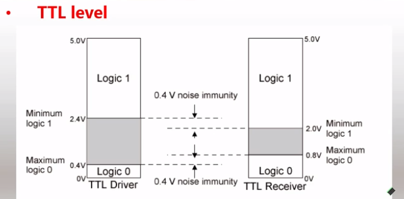

### PWM
pwm 脉冲宽度调制模块
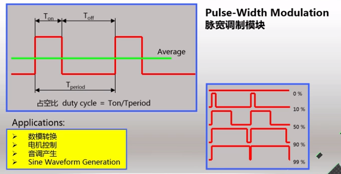

#### pwm 对齐
当使用多个PWM通道时，通过对齐模式控制不同通道信号的相位关系。
1. 边缘对齐
2. 中心对齐

### SPI
同步串行通讯接口（4线共地）。主从
1. miso 主入从出
2. mosi 数据线 主出从入
3. spsck 时钟
4. ss 片选线 低电平选通
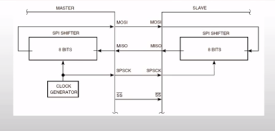

### I2C
双向2线制同步串行通信总线。
#### 基本特征
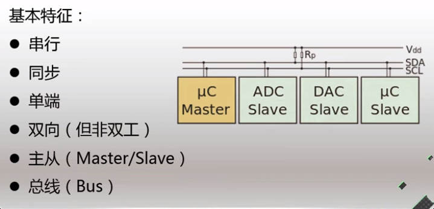
#### 电平标准
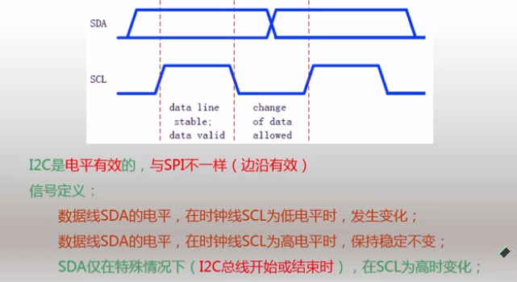
在传输数据时，时钟线为高电平，数据线保持稳定
在数据的起始位和停止位，时钟线为高电平，数据线发生跳变，由高到低，开始发送，由低到高，结束发送。
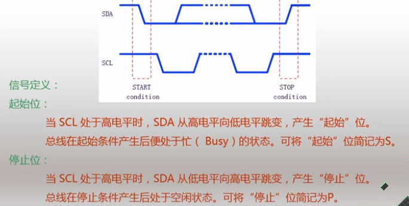
#### 数据帧格式
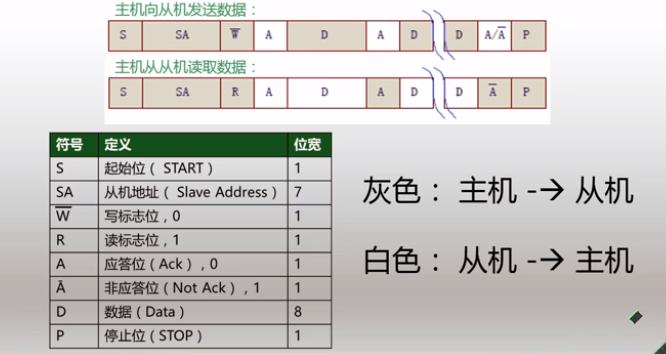
高位先发送，低位后发送，HSB在前，LSB在后。
#### 重复起始和子地址

#### 子地址的读和写操作
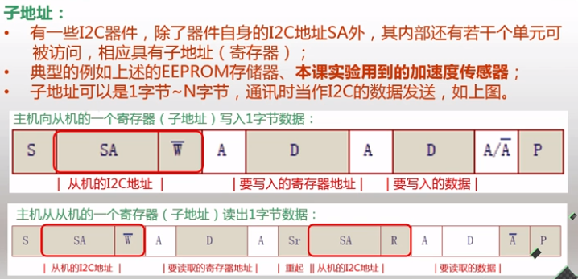
对于子地址的读操作，比较特殊，先写一次子地址后，在进行重复起始和读数据操作。

## 看门狗

### 看门狗的作用
当系统发生严重错误（如程序进入死循环等）不能 恢复的时候，WATCHDOG能够让系统重启。

硬件时钟中断喂狗：错误的看门狗设置方法，因为，硬件时钟中断的优先级很高，因此定时器会保持工作，持续喂狗，所以即使程序跑飞，也不能触发看门狗，使系统重启，所以应当避免硬件时钟中断喂狗。

### 丰田刹车门
[丰田刹车门](https://www.arduino.cn/forum.php?mod=viewthread&tid=4766&page=1)

## 电子学基本概念

### 编码器和译码器

74LS148 译码器

### mos管

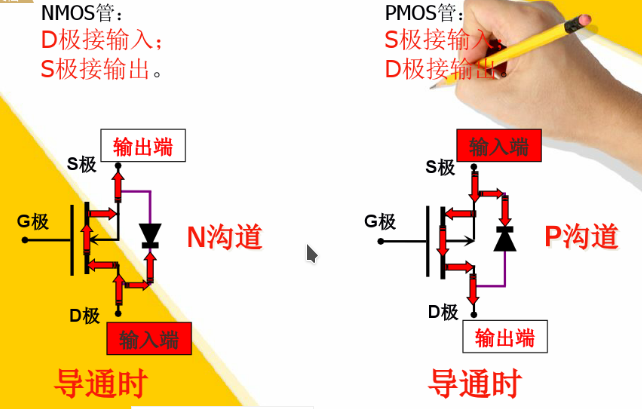

[mos管原理](https://wenku.baidu.com/view/24f282b0ed630b1c59eeb5b2.html)
### 上拉电阻和下拉电阻
作用是保证 io引脚没有输入，即悬空时的电平保持，当输入为高(低)时，下拉电阻(上拉电阻)能够保证输入前的引脚一直保持在低(高)电平。

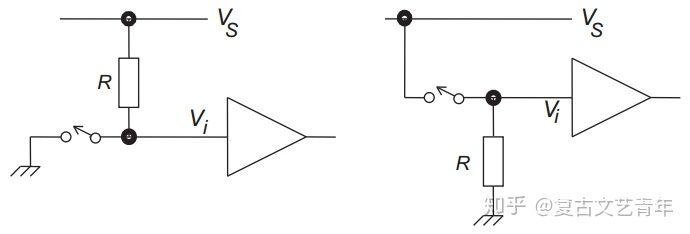
### 推挽输出 push-pull

Push-pull （推挽）和open drain （开漏） 都是单片机的GPIO配置成输出模式时，其中的两种输出方式。
因为是对称的n型MOSFET和p型的MOSFET对接而成，所以两个管子只可能有一个被接通，所以output要么被上拉到V+,要么被下拉到GND。
这种输出的方式的优点是不需要额外的外围电路（比如上拉电阻这种），板子设计比较简单，输出能力比较强，缺点是多个GPIO口不能接到一起，因为如果一个口在push时另外一个口pull了，里面的MOSFET管就会烧坏。另外一般单片机的输出能力是有上限的（比如单个口20mA,所有口加起来不能超过250mA）这样，设计板子时会需要注意这些问题。
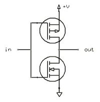

### 开漏输出 open drain

1. 推挽输出能够输出高或者低，而开漏输出只能输出低，或者关闭输出，因此开漏输出总是要配一个上拉电阻使用。
2. 开漏输出的上拉电阻不能太小，太小的话，当开漏输出的下管导通时，电源到地的电压在电阻上会造成很大的功耗，因此这个电阻阻值通常在10k以上，这样开漏输出在从输出低电平切换到高电平时，速度是很慢的。
3. 推挽输出任意时刻的输出要么是高，要么是低，所以不能将多个输出短接，而开漏输出可以将多个输出短接，共用一个上拉，此时这些开漏输出的驱动其实是或非的关系。
4. 推挽输出输出高时，其电压等于推挽电路的电源，通常为一个定值，而开漏输出的高取决于上拉电阻接的电压，不取决于前级电压，所以经常用来做电平转换，用低电压逻辑驱动高电压逻辑，比如3.3v带5v。

Open drain本身是没有上拉到V+的能力的，只能在floating和GND之间切换，所以一般的open drain都是需要上拉电阻的，如图：
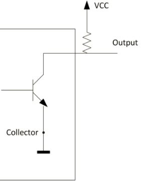

[od and push_pull](https://www.zhihu.com/question/68391288)