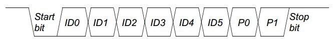

## 车辆点火不同模式 

* KL15 is ignition(点火) switch position #2 (on) ，run档位，点火起点，完成后复位
* KL30 is battery positive, hot at all times, 电源正极
* KL31 is battery negative, connected all the time， 电源负极
* KL50 is ignition position #3 (start)， 点火档 crank
* KLR means ignition switch position #1 (accessory)，acc档位，从off 到acc

### 不同档位功能

* KLR   ACC模式         radio 档，启动功能，收音机，
* KL15  Run 模式        启动功能，空调，升降车窗
* KL50  Crank 模式      点火档

### 不同档位下，继电器的开闭

--| acc | run | Crank |
 -|-|-|-|
ign1 | off | on | on |
ign2 | off | on | off |
start | off | off | on |

## lin总线
[说一说LIN总线](https://zhuanlan.zhihu.com/p/24393833)
[LIN总线入门](https://zhuanlan.zhihu.com/p/38833752)

通过帧ID求pid(protected id):
@import "./src/lin/main.c" {class="line-numbers"}

PID的全称是Protected identifier，它是header中一个最重要的结构，用于指示这个LIN帧的作用。从上图中可见，PID总共有6个bit的数据域，2个bit的保护域（根据前面的6个bit计算出来），所以PID总共有2的6次方，即64种取值，其中0 到 59 (0x3B)用于携带普通信号，60 (0x3C) 和 61 (0x3D)用于携带诊断数据和配置数据，62 (0x3E) 和 63 (0x3F)是保留的。

## can总线